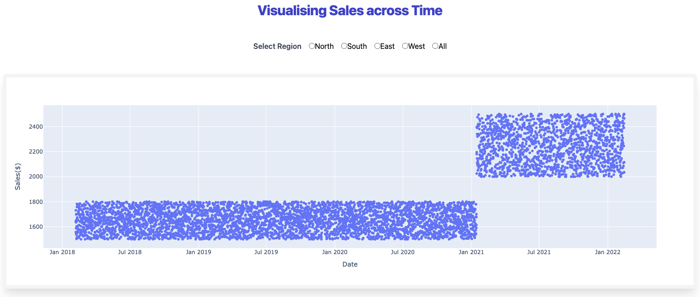

# Quantium The Forage Software Engineering

## Project Overview
This project is part of the Quantium Data Analytics Virtual Experience on Forage. It involves analyzing retail data to provide insights into customer purchasing behavior and evaluating the performance of store trials.

The goal is to visualise customer sales data to visualise the impact of a increase in prices on the 
sales of their products. The resultant graph shows a jump in sales coinciding with the timing of the price hike.

## Task 1: Data Preprocessing

Select necessary data, and standardise their format and types

## Task 2: Visualisation

Visualise data in a graph. Scatter plot was chosen over line graph as each point would represent a single transaction.
Data was then published into an interactive Plotly Dash dashboard featuring callback buttons to select varying regions in the data to facilitate breakdown for analysis.

## Tech Stack
Language: Python

Libraries: Plotly Dash, Pandas, Matplotlib

IDE: PyCharm

How to Run
Clone the repository.

Install dependencies: pip install -r requirements.txt.

Run the Python scripts in the /src folder.

